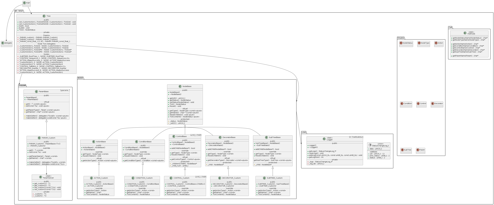
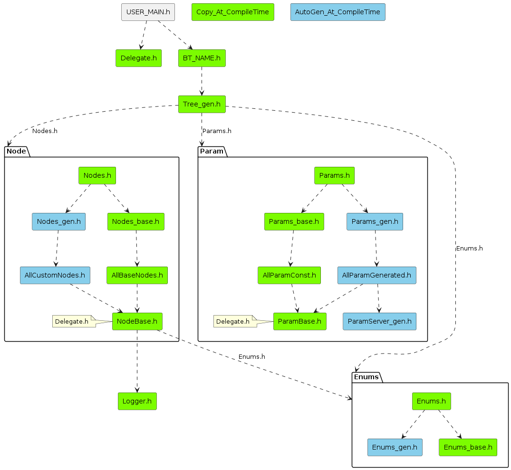

BT_Lite
===
BT_Lite is made to use light-weight Behavior Tree with embedded systems. Visualize, Edit, Generate XML flie with Groot[(github)](https://github.com/BehaviorTree/Groot). Using generated XML BT structure file, generator/BT_Generator.py will generate **Custom Header-Only Library** optimized for BT structure. Therefore we cannot support dynamical changes of Behavior Tree structure on runtime. As wee want to use Behavior Tree in Embedded environment, there's no 'new' or 'delete' for memory allocation. All memories needed for custom generated header-only library is specifically calulated at complile time. We use Delegate.h[(github)](https://github.com/rosbacke/delegate) to use pass the custom tick actions of custom behavior tree nodes. 

How To Use
---
1. Make Behavior Tree XML 
Using Groot.   
Parameter means   
3__uint8_t : const param 3, typename uint8_t   
{name1__float} parameter name : name1, typename : float, blackboard param

2. Make Custom Header-Only BT Library
Using generate/BT_Gen.py
    - arg -b : Behavior tree namespace name WIP   
    - arg -o : output directory WIP
    - arg -x : input XML behavior tree structure file path WIP

3. Integrate to CMake   
WIP

4. Use Example   
Use at main.cpp
```cpp
#include <stdio.h>

#include <BT_TEST/BT_TEST.h>

namespace MY
{
    using namespace BT_TEST;

    class testTick
    {
    public:
        NodeStatus TickDelegate(const float &f, int *i, NODE::NodeBase *node)
        {
            printf("this is node : %s , customActionTick\n", node->getName());
            printf("now state : %s\n", Cvt::getNodeStatusName(node->getStatus()));
            printf("%f, %d\n", f, *i);
            *i = f * 10;
            printf("%f, %d\n", f, *i);
            return NodeStatus::SUCCESS;
        }

        NodeStatus TickDelegate2(const float &f, float *i, NODE::NodeBase *node)
        {
            printf("this is node : %s , customActionTick\n", node->getName());
            printf("now state : %s\n", Cvt::getNodeStatusName(node->getStatus()));
            printf("%f, %f\n", f, *i);
            *i = f * 10;
            printf("%f, %f\n", f, *i);
            return NodeStatus::SUCCESS;
        }

        delegate<NodeStatus(const float &, int *, NODE::NodeBase *)> makeTickDel()
        {
            delegate<NodeStatus(const float &, int *, NODE::NodeBase *)> del;
            del.set<testTick, &testTick::TickDelegate>(*this);
            return del;
        }

        delegate<NodeStatus(const float &, float *, NODE::NodeBase *)> makeTickDel2()
        {
            delegate<NodeStatus(const float &, float *, NODE::NodeBase *)> del;
            del.set<testTick, &testTick::TickDelegate2>(*this);
            return del;
        }

    private:
    };
}

int main(int argc, char **argv)
{
    MY::testTick tickk;

    BT_TEST::RootTree.set_CustomAction1_tickDel(tickk.makeTickDel());
    BT_TEST::RootTree.set_CustomAction2_tickDel(tickk.makeTickDel2());

    BT_TEST::RootTree.build();

    BT_TEST::StatusChangeLog_t *logs;
    int logCount = 0;
    for (int i = 0; i < 3; i++)
    {
        BT_TEST::logger.clearLogs();
        BT_TEST::RootTree.Tick();
        BT_TEST::logger.getLogs();
        logCount = BT_TEST::logger.getLogSize();
    }
    return 0;
}
```


UML Diagram
---
Inspired from BehaviorTree.CPP[(github)](https://github.com/BehaviorTree/BehaviorTree.CPP)   


Header Include Diagram
---
No Circular Dependancies
